# MinhaVida
## Apresentação de Arquitetura e Modelagem UML

> **"Organize hoje, viva melhor amanhã."**

**Autor:** José Antonio de Almeida Silva
**Versão:** 1.0.0 · **Data:** 28/09/2026
**Conteúdo:** Resumo do projeto · Diagrama de Classes · Diagramas de Interação · Diagrama de Implantação

> 📊 **Slides prontos para projetar (21 slides):** https://claude.ai/artifact/HCE8uftTYYjjWZoe6phcds
> Os roteiros de fala do Paulo e do Júlio César estão em [`roteiro-paulo.txt`](roteiro-paulo.txt) e [`roteiro-julio-cesar.txt`](roteiro-julio-cesar.txt).

---

# PARTE I — RESUMO DO PROJETO

## 1. O problema

A vida pessoal hoje é gerenciada em ferramentas desconectadas: as tarefas ficam no aplicativo de notas, os compromissos no calendário, as contas a pagar em lembretes soltos e os gastos em uma planilha que ninguém atualiza.

O resultado é sempre o mesmo:

- **Fragmentação** — não existe uma visão única do dia
- **Esquecimento de vencimentos** — contas pagas com multa por falta de aviso
- **Falta de consciência financeira** — o dinheiro some sem que se saiba em quê
- **Abandono da ferramenta** — soluções genéricas exigem disciplina e devolvem pouco

## 2. A solução

O **MinhaVida** unifica os três pilares da organização pessoal em um único aplicativo mobile:

| Pilar | O que resolve | Telas |
|---|---|---|
| **Atividades** | CRUD de tarefas com categoria, prioridade, horário, duração e recorrência | Atividades · Cadastrar atividade |
| **Financeiro** | Receitas e despesas, saldo em tempo real, gasto por categoria, evolução mensal | Financeiro |
| **Importâncias** | Contas e compromissos com alerta de vencimento e quitação integrada | Importâncias |

## 3. O diferencial

A integração entre os pilares. Ao marcar *"Pagamento da internet — Vivo Fibra — R$ 99,90"* como concluída, o sistema, em **uma única ação**:

1. muda a importância para concluída
2. **gera automaticamente a despesa** correspondente
3. debita a conta e atualiza o saldo
4. cria a ocorrência do mês seguinte
5. cancela a notificação de vencimento

Nenhum concorrente direto no mercado brasileiro fecha esse ciclo em um só toque.

## 4. Persona

**Júlio César, 24 anos.** Estudante universitário que também trabalha. Rotina apertada entre faculdade, trabalho, academia e lazer. Usa o celular como computador principal. Precisa registrar em menos de 15 segundos e receber clareza imediata.

## 5. Escopo do MVP

**Dentro:** autenticação (e-mail/senha e Google) · CRUD de atividades com recorrência · CRUD financeiro com contas e categorias · importâncias com quitação integrada · painel diário e mensal · notificações push · perfil e preferências · funcionamento offline com sincronização.

**Fora (roadmap):** Open Finance · compartilhamento familiar · metas e investimentos · versão web · exportação contábil · gamificação.

## 6. Indicadores de sucesso

| Indicador | Meta |
|---|---|
| Tempo para registrar uma atividade | ≤ 15 s |
| Retenção em 30 dias | ≥ 35% |
| Redução de contas pagas em atraso | ≥ 50% em 3 meses |
| Tempo de resposta da API (p95) | ≤ 300 ms |
| Disponibilidade mensal | ≥ 99,5% |

## 7. Números da modelagem

| Elemento | Quantidade |
|---|---|
| Telas analisadas | 8 |
| Requisitos funcionais | 61 |
| Requisitos não funcionais | 32 |
| Regras de negócio | 24 |
| Casos de uso | 24 |
| Entidades de domínio | 15 |
| Tabelas no banco | 16 |
| Colunas mapeadas | 227 |
| Diagramas UML | 17 |

---

# PARTE II — DIAGRAMA DE CLASSES

## 8. O diagrama

### Versão-núcleo — as 8 classes essenciais


### Versão completa — 15 entidades, 3 objetos de valor, 19 enumerações


## 9. Como ler

| Notação | Significado |
|---|---|
| `-` privado · `#` protegido · `+` público | visibilidade dos membros |
| `◆——` composição | o todo controla o ciclo de vida da parte |
| `◇——` agregação | a parte existe independentemente |
| `——▷` generalização | herança |
| `«enumeration»` · `«value object»` · `«abstract»` | estereótipos |
| `1` · `0..1` · `0..*` | multiplicidade |

## 10. As quatro decisões que sustentam o modelo

### 10.1 Generalização `ItemAgendavel`
`Atividade` e `Importancia` compartilham título, descrição, categoria, prioridade, recorrência e lembrete — **e** comportamento: `concluir()`, `cancelar()`, `estaAtrasado()`. A superclasse abstrata captura isso e permite que o agendador de notificações trate as duas de forma polimórfica.

### 10.2 Receita e Despesa **não** são subclasses
Teriam exatamente os mesmos atributos, diferindo só no sinal aplicado ao saldo. Herança sem comportamento divergente é complexidade sem retorno. Usa-se o enum `TipoMovimento`, com o polimorfismo encapsulado em `Transacao.valorComSinal()`.

> A herança foi aplicada onde há comportamento diferente e evitada onde não há. Essa é a decisão, não o acaso.

### 10.3 `Categoria` unificada com escopo (padrão Composite)
As telas exibem três conjuntos de categorias e ainda o par "Categoria • Subcategoria". Em vez de três tabelas, uma entidade com o discriminador `escopo` e auto-relacionamento `categoriaPaiId`.

### 10.4 Objetos de valor
`Dinheiro`, `Email` e `PeriodoTempo` eliminam a obsessão por tipos primitivos. `Dinheiro` carrega valor **e** moeda juntos, tornando impossível somar reais com dólares por acidente.

## 11. Entidades e atributos

| Entidade | Atributos | Origem nas telas |
|---|---|---|
| `Usuario` | 20 | Cadastro, Login, Perfil |
| `PreferenciaUsuario` | 15 | Perfil (tema, idioma, notificações) |
| `CredencialSocial` | 6 | "Entrar com o Google" |
| `Sessao` | 12 | "Lembrar de mim", "Sair da conta" |
| `TokenRecuperacaoSenha` | 7 | "Esqueceu a senha?" |
| `DispositivoUsuario` | 8 | notificações push |
| `Categoria` | 12 | filtros e etiquetas de todas as telas |
| `RegraRecorrencia` | 11 | "Repetir (opcional)" |
| `Atividade` | 20 | Atividades, Cadastrar atividade |
| `ContaFinanceira` | 12 | "Saldo atual" |
| `Transacao` | 19 | "Últimas movimentações" |
| `Importancia` | 19 | Importâncias |
| `Orcamento` | 8 | "Categorias" |
| `Notificacao` | 13 | sino com indicador |
| `LogAuditoria` | 9 | conformidade LGPD |

> O dicionário completo, atributo por atributo, está em [`docs/04-DIAGRAMA-DE-CLASSES.md`](../docs/04-DIAGRAMA-DE-CLASSES.md) e em [`docs/07-DICIONARIO-DE-DADOS.md`](../docs/07-DICIONARIO-DE-DADOS.md).

## 12. Classes de projeto e inversão de dependência


O domínio declara a interface `IAtividadeRepository`; a infraestrutura fornece `AtividadeRepositoryPrisma`. Trocar o ORM não altera uma linha do domínio.

---

# PARTE III — DIAGRAMAS DE INTERAÇÃO

## 13. O que são

Mostram **como os objetos colaboram no tempo** para realizar um caso de uso. O diagrama de classes descreve a estrutura estática; estes descrevem o comportamento dinâmico.

| Tipo | Ênfase | Quantidade |
|---|---|---|
| **Sequência** | ordem temporal das mensagens | 8 |
| **Comunicação** | topologia das ligações entre objetos | 1 |

## 14. SD-01 — Cadastro de usuário

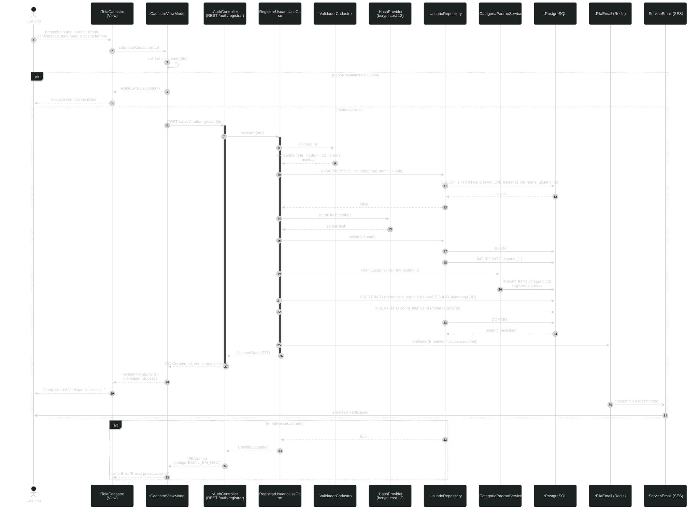

Validação em duas camadas · provisionamento atômico (usuário, preferências, 18 categorias e conta "Carteira" no mesmo COMMIT) · e-mail enfileirado, não enviado na requisição · fragmento `alt` para e-mail duplicado.

## 15. SD-02 — Autenticação

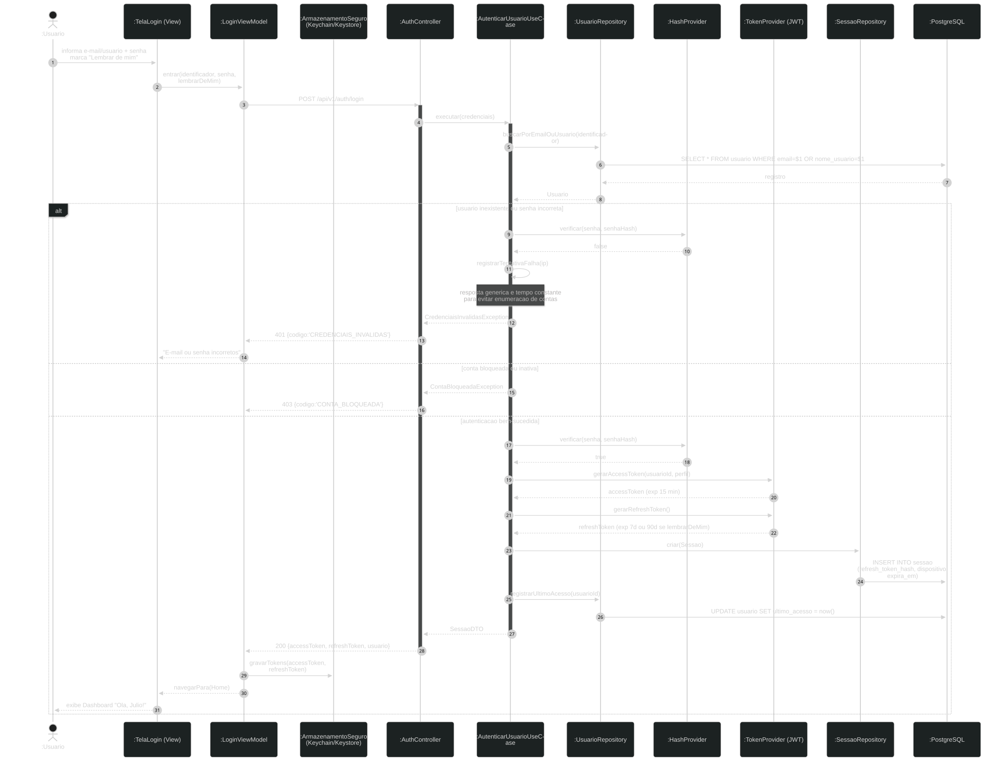

Resposta genérica em falha com tempo constante (impede enumeração de contas) · dois tokens com propósitos distintos · "Lembrar de mim" como parâmetro de validade · tokens no Keychain/Keystore.

## 16. SD-03 — Painel inicial

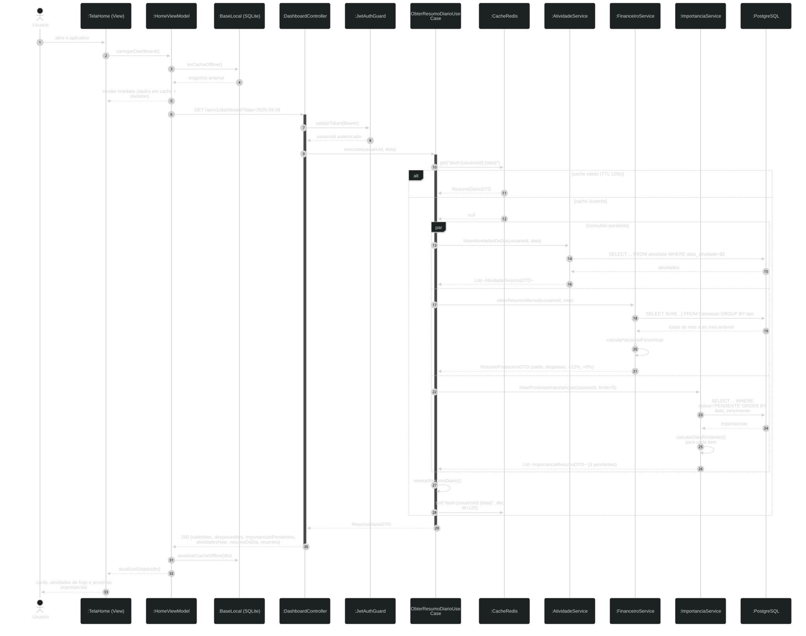

Renderização progressiva a partir do cache local · uma requisição agregada em vez de quatro · fragmento `par` para consultas paralelas · cache Redis de 120 s.

## 17. SD-04 — CRUD de atividade

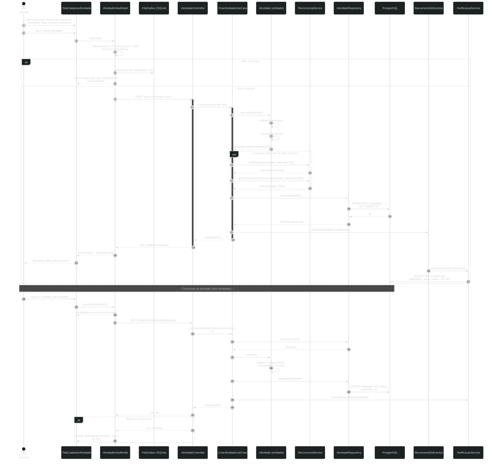

Modelo rico: quem valida e calcula a duração é a entidade, não o controller · fila outbox para o modo offline · evento de domínio agenda a notificação · atualização otimista com reversão em caso de falha.

## 18. SD-05 — Registro de transação financeira

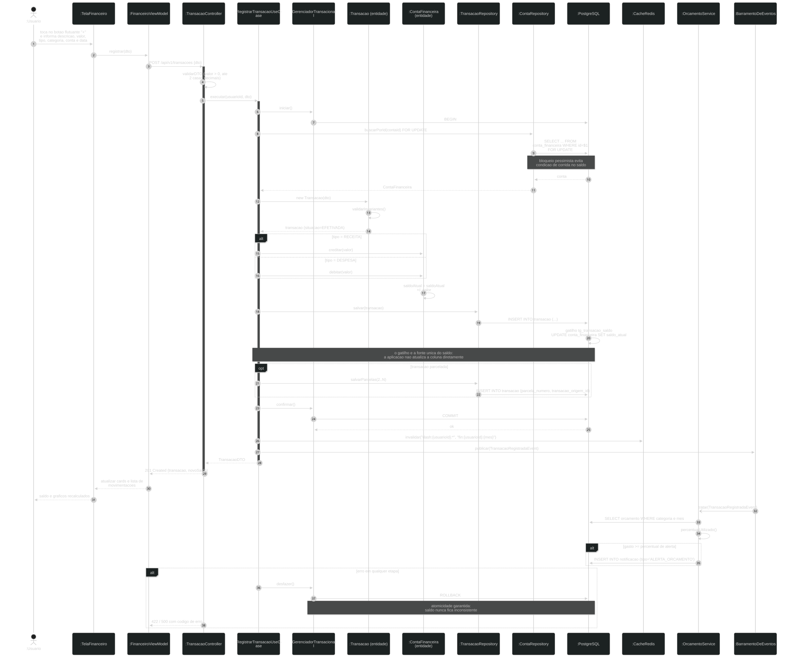

Bloqueio pessimista `SELECT … FOR UPDATE` contra condição de corrida · atomicidade obrigatória: o saldo jamais fica inconsistente · fonte única do saldo (o gatilho do banco, e só ele) · invalidação ativa de cache · verificação de orçamento por evento, fora do caminho crítico.

## 19. SD-06 — Quitação de importância ⭐

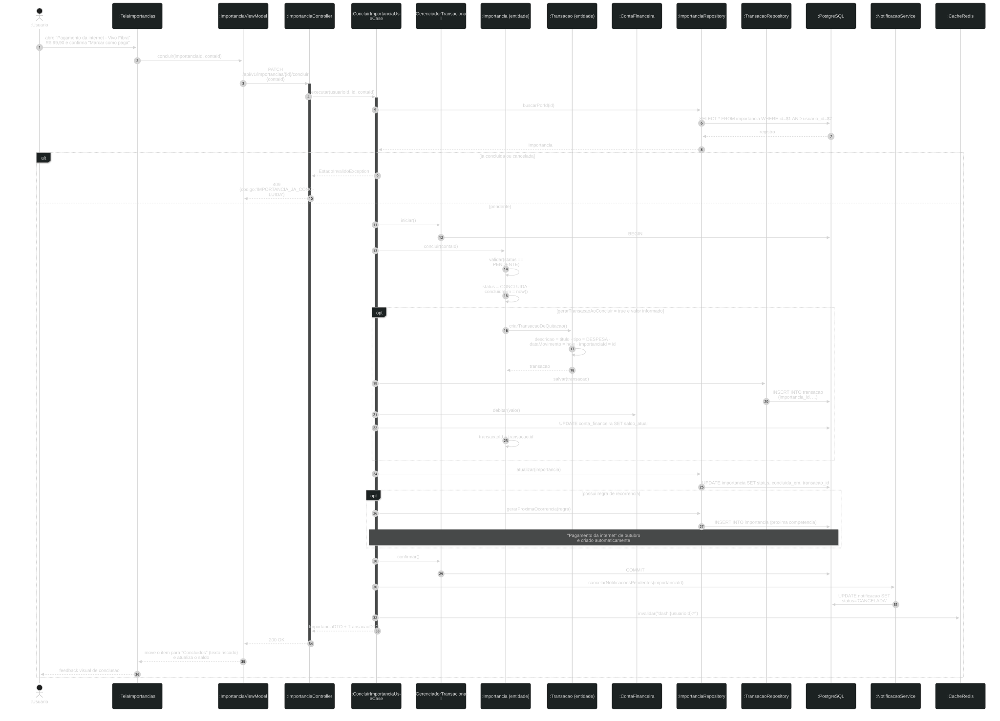

> **O diagrama mais importante do projeto.** Materializa o diferencial: um toque atravessa três contextos delimitados mantendo consistência total.

Os passos 1 a 4 (concluir, gerar transação, debitar conta, criar próxima ocorrência) ocorrem em **uma única transação de banco**. Os passos 5 e 6 (cancelar notificações, invalidar cache) ocorrem após o COMMIT, porque são efeitos colaterais que não podem derrubar a operação principal.

O fragmento `alt` de idempotência retorna `409 Conflict` em dupla marcação. Sem ele, um duplo toque geraria duas despesas.

## 20. SD-07 — Notificações agendadas

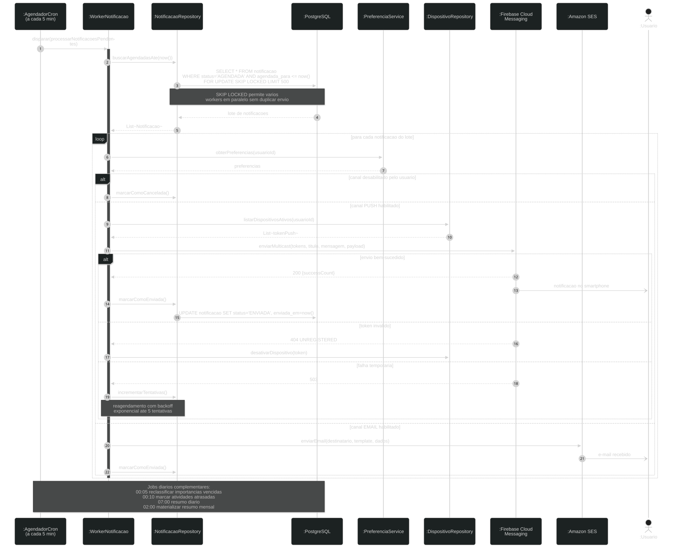

`FOR UPDATE SKIP LOCKED` permite vários workers em paralelo sem envio duplicado · preferências respeitadas antes do envio · token inválido desativa o dispositivo, falha temporária reagenda com recuo exponencial.

## 21. SD-08 — Sincronização offline

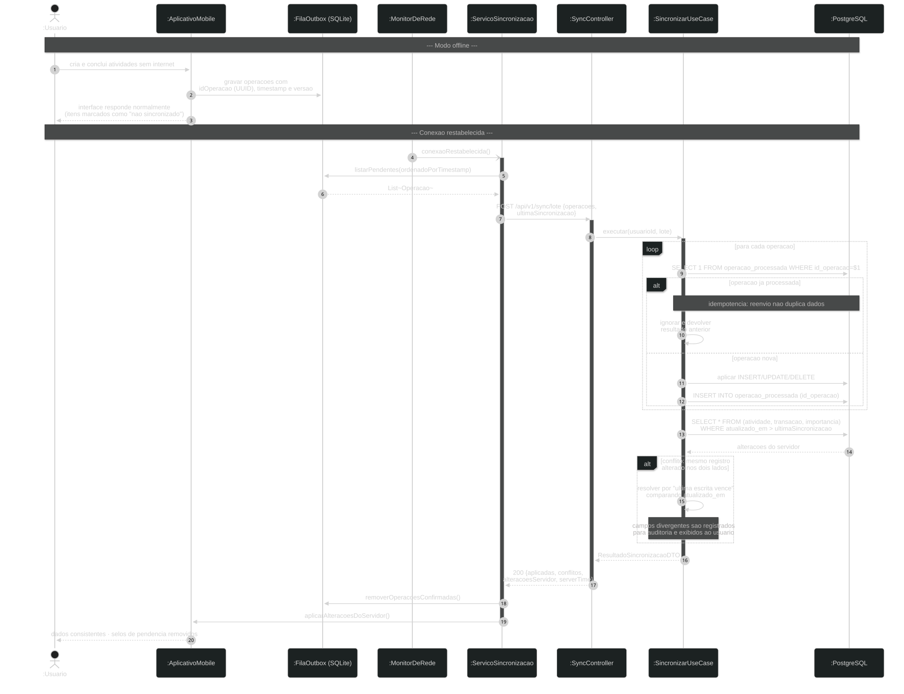

Idempotência por `idOperacao` gerado no cliente — é por isso que as chaves primárias são UUID e não sequenciais · sincronização em lote · resolução de conflito por última escrita vence, com registro da divergência.

## 22. DC-01 — Diagrama de comunicação


| Aspecto | Sequência | Comunicação |
|---|---|---|
| Ênfase | **quando** — ordem temporal | **quem fala com quem** — topologia |
| Ordem | implícita, de cima para baixo | explícita, por numeração |
| Ideal para | fluxos longos com condicionais | avaliar acoplamento |

Os dois são semanticamente equivalentes. O de comunicação revela o que o de sequência esconde: `RegistrarTransacaoUseCase` conversa com sete objetos — é o ponto de maior acoplamento do sistema.

---

# PARTE IV — DIAGRAMA DE IMPLANTAÇÃO

## 23. Ambiente de produção


## 24. Notação

| Elemento | Significado |
|---|---|
| `«device»` | nó físico ou virtual com capacidade de processamento |
| `«executionEnvironment»` | ambiente de execução hospedado em um nó |
| `«artifact»` | artefato implantável |
| Linha com anotação | caminho de comunicação com protocolo e porta |

## 25. Os quatro blocos

**Dispositivo do usuário** — aplicativo React Native, base SQLite para cache offline e fila outbox, tokens em Keychain/Keystore.

**Borda (Cloudflare)** — WAF, proteção DDoS e limite de 100 req/min por IP. A defesa acontece **antes** de o tráfego chegar à infraestrutura paga.

**Nuvem (AWS sa-east-1)** — balanceador, cluster Kubernetes com pods de API (2 a 6 réplicas, autoescalonamento a 70% de CPU) e de worker (1 a 3), PostgreSQL Multi-AZ com réplica de leitura, Redis, S3 e observabilidade.

**Serviços externos** — Firebase Cloud Messaging, Google Identity e Amazon SES.

## 26. Decisões de implantação

| Decisão | Justificativa |
|---|---|
| Região São Paulo | 15–30 ms de latência contra 120–180 ms na Virgínia · dados em território nacional simplifica a LGPD |
| Autoescalonamento 2–6 réplicas | Uso é sazonal (manhã, almoço, noite). Evita pagar pelo pico 24 h por dia |
| API e Worker separados | Disparar 10.000 notificações não pode degradar quem está usando o aplicativo |
| PostgreSQL Multi-AZ | Failover automático atende ao RTO de 1 hora |
| Réplica de leitura | Isola relatórios pesados da carga transacional |
| Redis único | Resolve cache, filas e limite de requisições com um só componente |

## 27. Custo estimado

| Recurso | Configuração | US$/mês |
|---|---|---|
| EKS + 2 × t3.medium | cluster | 133 |
| RDS PostgreSQL Multi-AZ | db.t3.small | 95 |
| ElastiCache Redis | cache.t3.micro | 25 |
| S3 + ALB + Cloudflare | 50 GB | 30 |
| **Total (até ~10.000 usuários)** | | **≈ 283** |

> Para a fase de validação, API e Worker em um serviço gerenciado (Railway, Render, Fly.io) com banco e Redis inclusos custam cerca de **US$ 25/mês**. A arquitetura em contêineres permite essa migração sem alterar código.

## 28. Ambiente acadêmico e de desenvolvimento


```bash
docker compose up -d      # api, postgres, redis, minio, pgadmin
npm run migration:run
npm run seed
```

O MinIO expõe a mesma API do S3 — o código de upload é idêntico nos dois ambientes; muda apenas a variável `S3_ENDPOINT`.

---

# PARTE V — VALIDAÇÃO E PRÓXIMOS PASSOS

## 29. A modelagem foi testada, não apenas desenhada

O esquema e a carga de demonstração foram **executados em PostgreSQL 16.13 real**. O modelo reproduz exatamente os indicadores das telas:

| Indicador | Calculado pelo modelo | Exibido na tela |
|---|---|---|
| Saldo atual | R$ 1.220,35 | R$ 1.220,35 ✔ |
| Receitas do mês | R$ 2.450,75 | R$ 2.450,75 ✔ |
| Despesas do mês | R$ 1.230,40 | R$ 1.230,40 ✔ |
| Total de atividades | 12 | 12 ✔ |
| Concluídas / Pendentes | 10 / 2 | 10 / 2 ✔ |
| Tempo total | 18h45min | 18h45min ✔ |
| "Compra do mês" | 6 dias | "Em 6 dias" ✔ |

E as regras de negócio foram testadas contra o banco — todas rejeitando corretamente as violações: valor negativo, horário invertido, exclusão de categoria do sistema, escopo divergente, idade mínima. A quitação de importância gerou a despesa e debitou o saldo em R$ 99,90, como projetado.

## 30. Três inconsistências encontradas no protótipo

| # | Achado | Decisão necessária |
|---|---|---|
| 1 | Na tela Financeiro, as fichas de categoria somam R$ 1.661,40, mas o card informa R$ 1.230,40 | Ajustar os valores das fichas |
| 2 | O salário aparece como 28/09 · R$ 3.200,00 na tela Início e 29/09 · R$ 2.450,75 na tela Financeiro | Unificar data e valor |
| 3 | O card "Saldo do mês" da tela Início exibe R$ 2.450,75, que é a **receita**, não o saldo (R$ 1.220,35) | Corrigir o rótulo ou o valor |

> Divergências assim são normais em protótipo de alta fidelidade — os números são escritos à mão, um a um. O valor de modelar antes de programar está em fazê-las aparecer agora, e não em produção.

## 31. Próximos passos

| Etapa | Entregável | Base já pronta |
|---|---|---|
| 1. Banco de dados | Executar `banco/schema.sql` | DDL validado em PostgreSQL 16 |
| 2. Modelagem de dados | Migrações versionadas | Dicionário com 227 colunas |
| 3. Levantamento de requisitos | Documento formal | 61 RF, 32 RNF, 24 RN, 24 casos de uso |
| 4. Back-end | API NestJS em camadas | Contrato REST com 60+ endpoints |
| 5. Mobile | Aplicativo React Native | Arquitetura MVVM + Clean definida |

## 32. Conclusão

O MinhaVida está **completamente especificado**: das 8 telas ao esquema de banco executável, dos 61 requisitos aos 17 diagramas UML, das decisões arquiteturais justificadas ao custo mensal estimado.

Nada foi desenhado por convenção. Cada decisão — a generalização `ItemAgendavel`, o enum em vez de herança para receita e despesa, o Composite em `Categoria`, o gatilho como fonte única do saldo, o UUID que viabiliza o modo offline — tem justificativa registrada e consequências assumidas.

**A partir daqui, programar é traduzir. As decisões difíceis já foram tomadas.**
