# MinhaVida — Diagramas Complementares

Além dos três diagramas solicitados (Classes, Interação e Implantação), estes complementam a documentação e sustentam o levantamento de requisitos e a modelagem de dados.

---

## 1. Diagrama de Casos de Uso


24 casos de uso distribuídos em 5 módulos. Os relacionamentos merecem atenção:

| Relacionamento | Significado |
|---|---|
| `UC21 Concluir importância` **«include»** `UC13 Registrar receita/despesa` | A quitação **sempre** dispara o registro financeiro quando há valor — não é opcional, faz parte do caso de uso |
| `UC22 Visualizar dashboard` **«include»** `UC08`, `UC14`, `UC20` | O painel é, por definição, a composição das três consultas |
| `UC07 Cadastrar atividade` **«extend»** `UC12 Definir recorrência` | A recorrência é um comportamento **opcional** que estende o cadastro |
| `UC02 Autenticar` **«extend»** Google Identity | O login social é um caminho alternativo, não obrigatório |

A distinção entre `«include»` e `«extend»` não é detalhe formal: ela determina se o código do caso de uso invoca o outro incondicionalmente ou sob guarda.

---

## 2. Diagrama de Máquina de Estados — `Atividade`



Cinco estados e as transições permitidas. Dois pontos de projeto:

- A transição `PENDENTE → ATRASADA` **não é disparada pelo usuário**: é o job diário das 00:10 que a executa. Estados que mudam sozinhos com o tempo precisam de um agente que os mova.
- `CONCLUIDA → PENDENTE` (reabrir) existe porque erros de marcação são comuns. A ação de entrada em `CONCLUIDA` também cancela o lembrete agendado — caso contrário, o usuário receberia notificação de algo que já concluiu.

---

## 3. Diagrama de Máquina de Estados — `Importancia`



O estado `VENCENDO_HOJE` existe para dar à interface o que ela precisa para destacar o item em vermelho, sem recalcular a data a cada renderização.

A ação de entrada em `CONCLUIDA` concentra quatro efeitos — gerar a transação, debitar a conta, criar a próxima ocorrência e cancelar as notificações. É o mesmo comportamento descrito no diagrama de sequência SD-06, aqui visto pela ótica do ciclo de vida do objeto.

---

## 4. Modelo Entidade-Relacionamento



Visão lógica do banco de dados. Enquanto o diagrama de classes mostra comportamento e herança, o modelo ER mostra **como isso é persistido**: `ItemAgendavel` não aparece aqui, porque a generalização foi resolvida como *table per concrete class* (ADR-03) — existem `atividade` e `importancia`, não uma tabela de superclasse.

O relacionamento `IMPORTANCIA |o--o| TRANSACAO` é opcional dos dois lados: uma importância pode não ter transação (ainda não quitada, ou compromisso sem valor) e uma transação pode não ter importância (lançamento avulso).

---

## Como os diagramas se articulam

```
Casos de Uso ──── o que o sistema faz (requisitos)
      │
      ├──▶ Classes ─────── com quais objetos (estrutura)
      │        │
      │        └──▶ Modelo ER ──── como persistir (banco de dados)
      │
      ├──▶ Interação ───── em que ordem colaboram (comportamento)
      │
      ├──▶ Estados ─────── como cada objeto evolui no tempo
      │
      └──▶ Implantação ─── onde tudo isso executa (infraestrutura)
```

Cada diagrama responde a uma pergunta diferente. Juntos, cobrem as visões estrutural, comportamental e física exigidas pela UML 2.5 — e são suficientes para começar a programar sem adivinhar nada.
